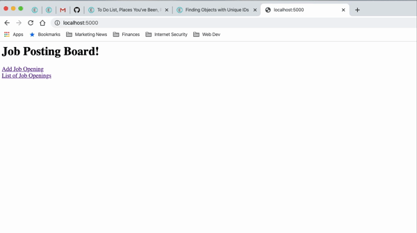

# _Job Board_

#### _A C# job posting board application_, _Mar. 11, 2020_

#### By _**Benjamin Thom**_

## Description

_A job posting board where a user can view and create job openings with details specific to the user's input._

## Preview



## Project Specifications

| Behavior | Input | Output |
|---|:---:|:---:|
|user begins at the home page where they have the options to "Add Job Opening" or view "List of Job Openings"|click on "Add Job Opening"|"/jobs/new" view|
|//|click on "List of Job Openings"|"/jobs" view|
|user clicks on "Add Job Opening" and enters form inputs for job Title, Description, Contact Name, Contact Email, and Contact Phone Number and clicks submit button|Title: Jr Software Engineer, Description: Entry level software engineer looking to learn and grow with an exciting Portland startup!, Contact Name: Reily O'Reily, Contact Email: OReily@TechPdx.com, Contact Phone Number: (503) 867-5309 - user then clicks submit button|"/job" view: user is shown List of Job Openings, including the details they provided|

## Setup/Installation Requirements

_In Terminal:_

* Navigate to where you want this application to be saved, i.e.:
```cd desktop```
* Clone the file from GitHub with HTTPS
```git clone https://github.com/benjamin-thompdx/ToDoList.Solution.git```
* Open file in your preferred text editor
* On Mac: ```open -a {your text editor} ToDoList.Solution```
* On Windows: ```ToDoList.Solution```

_Download Manually:_

* Navigate to https://github.com/benjamin-thompdx/ToDoList.Solution.
* Click the green "Clone or Download" button.
* Click "Download ZIP".
* Click downloaded file to unzip.
* Open folder called "ToDoList.Solution".

_Note For Editors:_ 
* Download the .NET Core SDK [Software Development Kit](https://dotnet.microsoft.com/download)
* Open the .Net Core SDK file and install
* To confirm installation was successful, run the ```$ dotnet --version``` command in your terminal

* Install dotnet script, run the ```$ dotnet tool install -g dotnet-script``` command in your terminal
* Restart your terminal to complete installation, and run the ```$ dotnet run``` command to run application within your terminal - Note: To exit, simply press ```Ctrl + C```

## Known Bugs

_No known bugs at this time._

## Support and contact details

_Have a bug or an issue with this application? [Open a new issue](https://github.com/benjamin-thompdx/ToDoList.Solution/issues) here on GitHub._

## Technologies Used
* _Git_
* _C#_
* _.NET Core 2.2_
* _dotnet script_
* _VS Code_
* MVC framework
* CRUD functionality

### License

*This webpage is licensed under the MIT license.*

Copyright (c) 2020 **_Benjamin Thom_**
